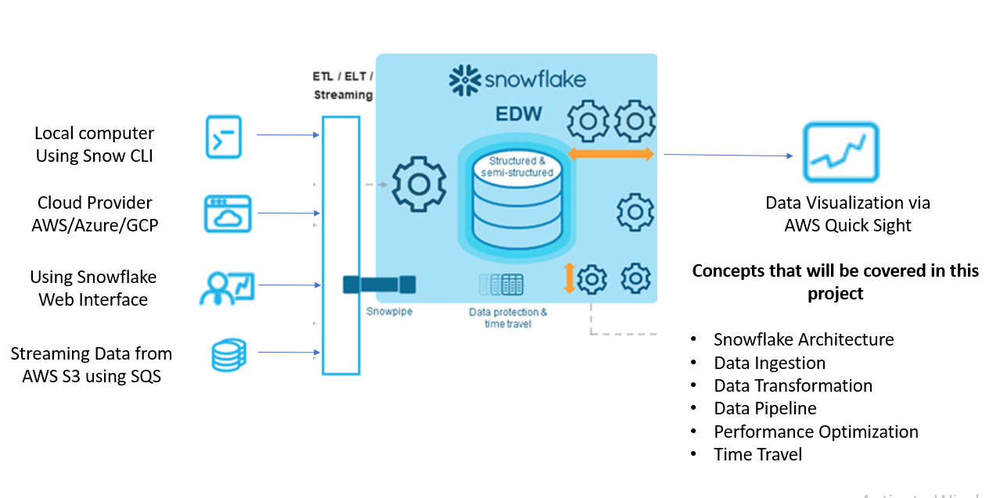

## Business Overview
Snowflake's Data Cloud is based on a cutting-edge data platform delivered as a service(SaaS). Snowflake provides data storage, processing, and analytic solutions that arequicker, easier to use, and more versatile than traditional options.

Snowflake isn't based on any current database technology or large data software
platforms like Hadoop. Snowflake, on the other hand, combines a brand-new SQL query
engine with cutting-edge cloud architecture. 

Snowflake gives users all the features and capabilities of an enterprise analytic database, plus a lot more.
- There is no hardware to choose, install, configure, or manage (virtual or actual).
- There isn't much to install, set up, or maintain in terms of software.
- Snowflake oversees ongoing maintenance, administration, updates, and tweaking

## Tech Stack:
➔ Languages: SQL  
➔ Services: Amazon S3, Snowflake, SnowSQL, QuickSight

## Key Takeaways
- Introduction to Snowflake
- Understanding Snowflake Architecture
- Understanding Security in Snowflake
- Preparation of files
- Configuration setup for Snowflake
- Loading data through the web interface
- Loading data through SnowSQL
- Loading data using Cloud Provider
- Streaming data using Snowpipe
- Visualization using QuickSight
- Understanding pricing of Snowflake
- Time Travel in Snowflake
- Performance optimization in Snowflake

## What we'll learn

